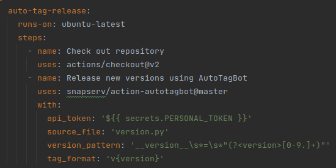
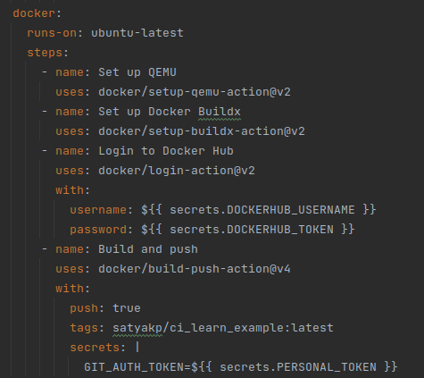
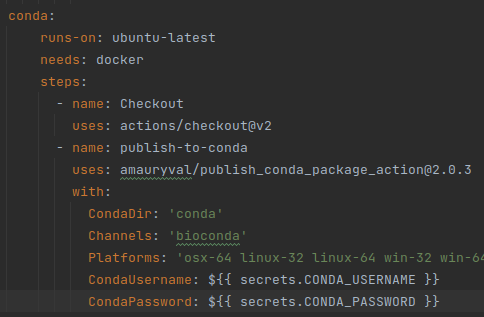

# Project Description
**KMA** is mapping a method designed to map raw reads directly against redundant databases, in an ultra-fast manner using seed and extend. 

# Setup

To setup and run this, we require the below files:  
* **version.py**  - To maintain the sematic version of the application in python format.  
* **Dockerfile** - This file contains source path of the code that is build as dockerimage.      
* **meta.yaml** - This file contains the source code details of kma project which will be used to build in anaconda distribution.      
* **conda_build_yaml_file** - This file includes the channels and dependencies required for the project.
* **version.yaml** - Workflow file that triggers the events, builds and helps to push the latest changes into dockerhub and anaconda distribution. 

## Usage
### automatic-tag-release
 As part of continuous integration, automatic-tag-release job from **version.yaml** would check the repository and validate the version that is mentioned in the **version.py** and it would create the automatic release tag.

  

### docker
 Once the tag is created, **version.yaml** would check the **Dockerfile**, creates a docker image from the repository and then push it into the **Dockerhub**

  

### Conda
 Once the **dockerimage** is pushed into **dockerhub**, **version.yaml** would build a conda package and then push it into the **anaconda distribution**

  

### secrets
 
Secrets related to the authentication of dockerhub, conda and other all are maintained under the secrets section in the github repository.   

## Project Structure

## Github triggering events       
Only when we make a push from development branch to main branch, the event is triggered. NOTE: Not when testing branches to development branches. 

