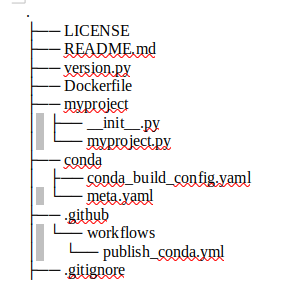

# Project Description
**KMA** is mapping a method designed to map raw reads directly against redundant databases, in an ultra-fast manner using seed and extend. 

# Setup

To setup and run this, we require the below files:  
* **version.py**  - To maintain the sematic version of the application in python format.  
* **Dockerfile** - This file contains source path of the code that is build as dockerimage.      
* **meta.yaml** - This file contains the source code details of kma project which will be used to build in anaconda distribution.      
* **conda_build_yaml_file** - This file includes the channels and dependencies required for the project.
* **version.yaml** - Workflow file that triggers the events, builds and helps to push the latest changes into dockerhub and anaconda distribution. 

## Usage
**automatic-tag-release**

Once after we make a push to github, we check the actions tab.     
In actions tab, we check the jobs listed in version.yml file i.e., 1)auto-tag-release 2)docker 3)conda
After completing the jobs in actions, check dockerhub and anaconda for latest code changes. 

## Project Structure

## Github triggering events       
Only when we make a push from development branch to main branch, the event is triggered. NOTE: Not when testing branches to development branches. 

